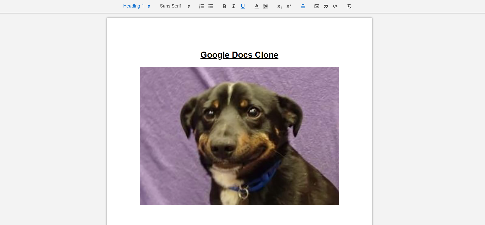

# Google Docs Clone

<<<<<<< HEAD
This is a clone of the popular Google Docx Editor.
=======
This is a clone of Google Word Docx.
>>>>>>> 7da8fc1e17c063d77fd7329ba88a720ff3985995

## Features

1. Create and edit new files
2. Resume editting from where you left
3. General text editor features like bold, italics, etc.
4. Real-time editting (i.e. changes are reflected in all open instances of the document over all networks in real time)
5. Multiple Users can simultaneously edit the document

## Tech Stack used

1. ReactJS
2. MongoDB
3. Sockets.io
4. QuillJS
